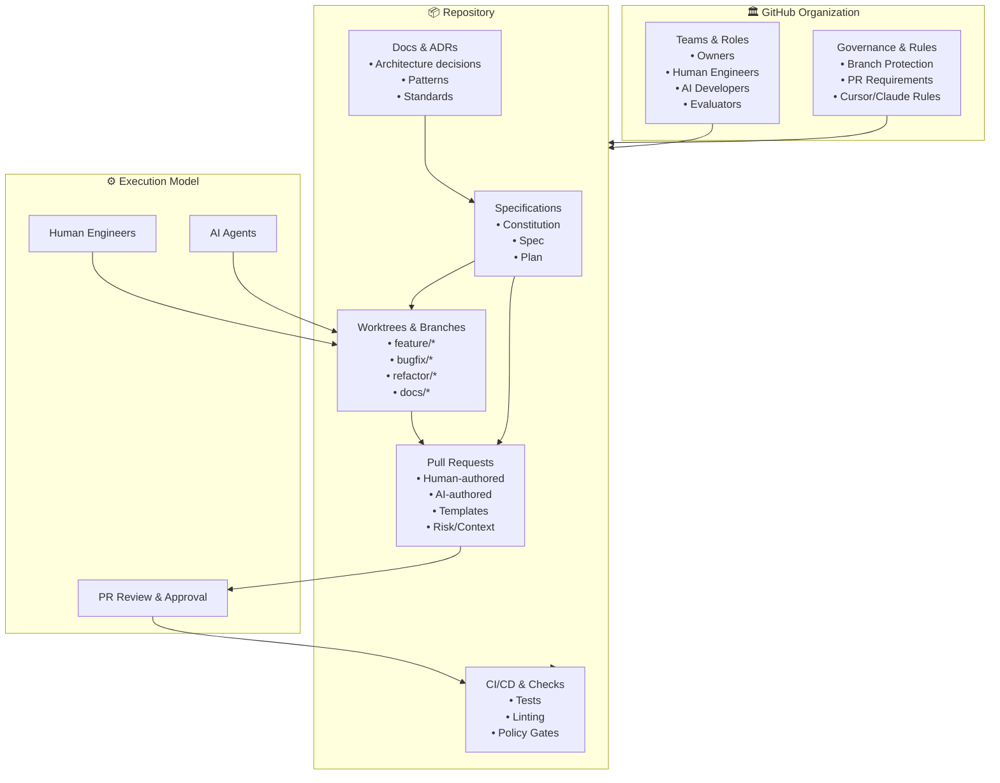

# Overview Diagram — GitHub-Native Hybrid Engineering Model

```mermaid
flowchart TD

    subgraph Org["🏛️ GitHub Organization"]
        direction TB
        Teams["Teams & Roles<br/>• Owners<br/>• Human Engineers<br/>• AI Developers<br/>• Evaluators"]
        Policies["Governance & Rules<br/>• Branch Protection<br/>• PR Requirements<br/>• Cursor/Claude Rules"]
    end

    subgraph Repo["📦 Repository"]
        direction TB
        Specs["Specifications<br/>• Constitution<br/>• Spec<br/>• Plan"]
        Worktrees["Worktrees & Branches<br/>• feature/*<br/>• bugfix/*<br/>• refactor/*<br/>• docs/*"]
        PRs["Pull Requests<br/>• Human-authored<br/>• AI-authored<br/>• Templates<br/>• Risk/Context"]
        CI["CI/CD & Checks<br/>• Tests<br/>• Linting<br/>• Policy Gates"]
        ADRs["Docs & ADRs<br/>• Architecture decisions<br/>• Patterns<br/>• Standards"]
    end

    subgraph Execution["⚙️ Execution Model"]
        direction LR
        Human["Human Engineers"]
        Agent["AI Agents"]
        Review["PR Review & Approval"]
    end

    Teams --> Repo
    Policies --> Repo
    Human --> Worktrees
    Agent --> Worktrees
    Worktrees --> PRs
    PRs --> Review
    Review --> CI
    CI --> Repo
    Specs --> Worktrees
    Specs --> PRs
    ADRs --> Specs
```