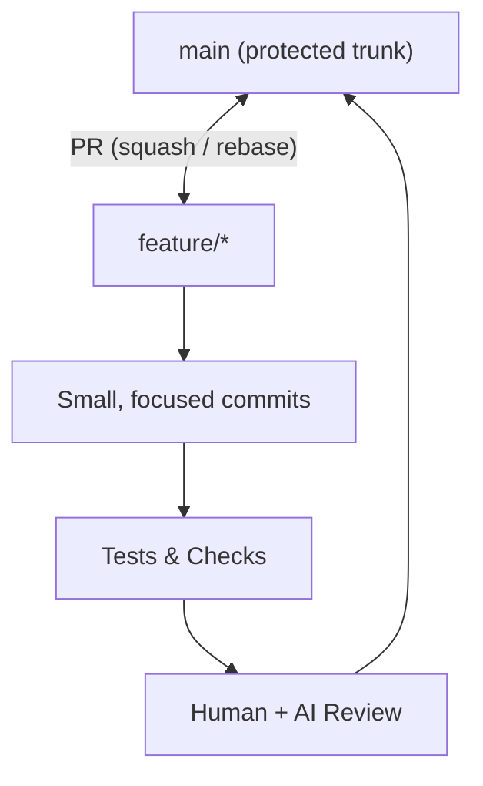

# Branching & Workflow Standards (November 2025)

This document defines the **current, modern, recommended branching and workflow approach for GitHub repositories** as of **November 2025**.
It is grounded in GitHub’s official documentation, trunk-based engineering practices, and the realities of AI-augmented software development.

---

## 1. Guiding Principles

Modern GitHub development is built around **four core principles**:

1. **`main` is the trunk** — the single source of truth and deployment origin.  
   GitHub documents this explicitly in its “lightweight, branch-based workflow” model.

2. **Short-lived branches** are used for all work.  
   These branches are created from `main`, remain open only as long as necessary, and are deleted after merge.

3. **Pull Requests are the only path into `main`.**  
   PRs act as the governance plane where teams (and AI agents) run checks, reviews, discussions, and approvals.  
   GitHub calls this the “small, rapid iterations” model.

4. **Continuous integration and automated checks gate every merge.**  
   GitHub requires PRs to pass checks (tests, linting, security, AI code analysis, etc.) before merging.

This collective model is commonly referred to as **GitHub’s current recommended workflow**
and mirrors the industry-standard version of **trunk-based development**.

---

## 2. Branching Model

Modern GitHub practice simplifies branching into a single, predictable structure:

```text
main                 # protected trunk
feature/<task>       # short-lived task branches
bugfix/<issue>       # short-lived fix branches
refactor/<area>      # short-lived refactor branches
docs/<topic>         # documentation branches
```

### Key properties

- **All branches originate from `main`.**
- **Branches remain small, focused, and temporary.**
- **Branch lifetime is measured in hours or days—not weeks.**
- **Completed branches are deleted after PR merge.**

GitHub describes this workflow as a lightweight, branch-based model that enables **rapid, incremental ship cycles**.

---

## 3. Pull Requests as the Control Surface

GitHub positions the PR page as the primary mechanism by which code enters the trunk:

- Code review
- Automated CI
- Security scanning
- AI-generated analysis and reasoning
- Conversation and clarification
- Approval gates

GitHub’s own docs emphasize that **every change enters `main` through a Pull Request**.

### Required PR structure

A typical modern PR includes:

- **Summary** (intent of the change)
- **Context** (why the change exists)
- **Implementation Details**
- **Testing & Validation** (tests or manual verification)
- **Risks & Rollback** (impact and recovery plan)

This structure aligns with GitHub’s documented review guidelines and PR patterns.

---

## 4. Protected Branches & GitHub Rulesets

GitHub’s current branch protection capabilities (Rulesets, Protected Branches) allow organizations to:

- Require PRs before merging
- Block direct pushes to `main`
- Require status checks (CI/tests/security)
- Require reviews
- Prevent force pushes
- Optionally enforce linear history

These settings are explicitly part of GitHub’s recommended governance model.

**Result:**  
`main` becomes an always-deployable, always-stable branch.

---

## 5. Merge Strategy

Two merge patterns dominate:

### ✔ Squash Merge (recommended default)

- Produces a single commit on `main`
- Keeps trunk history clean
- Ideal for AI-assisted development and rapid iteration

### ✔ Rebase + Merge (common alternative)

- Produces a linear commit history
- Avoids merge bubbles
- Works well in CI-heavy or agentic workflows

### ❌ Merge commits

Rare in modern practice due to:

- history noise
- increased risk of conflict
- poor suitability for automated reasoning tools

---

## 6. Branch Naming Conventions

Use consistent, human-readable names:

```text
feature/<id>-<short-description>
bugfix/<issue-id>-<fix>
refactor/<area>
docs/<topic>
```

Examples:

```text
feature/143-add-neo4j-gds-loader
bugfix/77-fix-ragas-metric
docs/update-contribution-guide
```

GitHub recommends clear naming so PRs and discussions are easily linked to Issues and Projects.

---

## 7. Workflow Summary

### 1. Create a branch

```bash
git checkout -b feature/123-improve-auth
```

### 2. Commit small, incremental changes

```bash
git add .
git commit -m "Add token expiration validation to auth service"
```

### 3. Push branch

```bash
git push -u origin feature/123-improve-auth
```

### 4. Open a Pull Request

The PR triggers:

- automated CI
- automated security
- optional AI review
- human review
- discussion and iteration

### 5. Merge into `main`

Using **squash** or **rebase + merge**.

### 6. Delete the branch

Returning the repo to a clean state.

GitHub explicitly documents this cycle.

---

## 8. Why This Model Dominates in 2025

Three converging drivers:

### 1. Cloud-native CI/CD

Rapid, incremental merges map cleanly to automated deployment systems.

### 2. Developer Experience

Simple branching reduces onboarding friction and improves review speed.

### 3. AI-augmented software development

Agents (Cursor, Copilot Workspace, LangGraph) operate far more safely when:

- `main` is protected
- all edits happen on ephemeral branches
- PR review acts as a human-in-the-loop safety gate
- diff size is small and easy to reason about

GitHub’s own documentation emphasizes the importance of keeping work small and PR-centered for reviewability and safety.

---

## 9. Final Model (to adopt everywhere)

This single diagram captures current GitHub best practices:

```text
main  ← protected trunk
  ↑
  │  merge (squash or rebase) via PR only
  │
feature/*  ← short-lived branches for all work
```

This is the **recommended GitHub workflow** — simple, lightweight, PR-first, trunk-based, and optimized for modern engineering and agentic AI development.

---

## 10. Visual: Mermaid Diagram



---

Tooling integrations (Cursor, Claude Code, Copilot Workspace, etc.) that enforce or assist with this workflow
should be documented separately under `docs/tooling/`.
