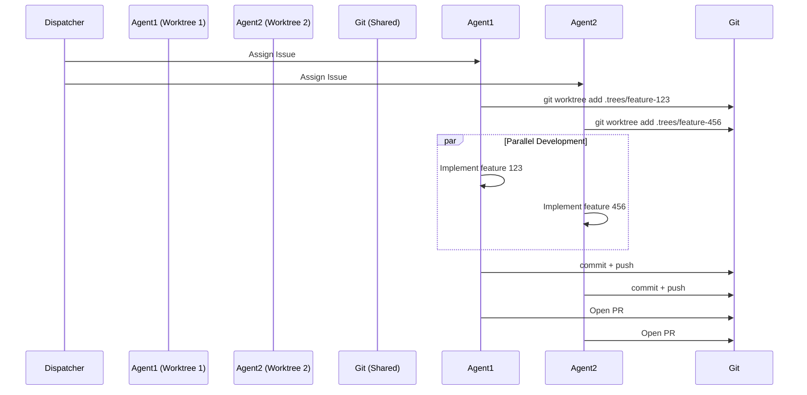

# Git Worktrees: Practical Guide for Multi-Agent Development

This guide provides step-by-step instructions for using git worktrees to enable parallel development by multiple AI agents (or human developers) working on different features simultaneously.

**Context:** This guide is the practical implementation of Part VII (Agentic Execution Layer) from the [GitHub-Native Operating Model](../github-native-operating-model.md#part-vii--the-agentic-execution-layer).

---

## Table of Contents

- [What Are Git Worktrees?](#what-are-git-worktrees)
- [Why Use Worktrees for Multi-Agent Development?](#why-use-worktrees-for-multi-agent-development)
- [Directory Structure Convention](#directory-structure-convention)
- [Parallel Agent Workflow](#parallel-agent-workflow)
- [Merge Strategy](#merge-strategy)
- [Cleanup Procedures](#cleanup-procedures)
- [Troubleshooting](#troubleshooting)

---

## What Are Git Worktrees?

Git worktrees allow you to check out multiple branches from a single repository simultaneously. Each worktree has its own working directory but shares the same `.git` database, making them efficient and preventing data duplication.

**Traditional approach:**
```bash
# Switch branches (must stash/commit changes first)
git switch feature/A
# work...
git switch feature/B  # Context switch, must clean working directory
```

**Worktree approach:**
```bash
# Create separate working directories
git worktree add .trees/feature-A feature/A
git worktree add .trees/feature-B feature/B
# Work on both simultaneously in different terminals/agents
```

---

## Why Use Worktrees for Multi-Agent Development?

### **Problem:** Context Confusion in Multi-Agent Scenarios

When multiple AI agents (or humans) work from a single repository clone:
- Agents overwrite each other's changes
- Branch switches disrupt active work
- File modifications conflict across contexts
- Hard to track which agent is working on what

### **Solution:** Git Worktrees

Each agent gets:
- **Isolated working directory** - No file conflicts
- **Independent branch checkout** - No context switching
- **Shared git database** - Efficient disk usage
- **Parallel execution** - True concurrency

### **Operating Model Alignment**

From Part VII of the [operating model](../github-native-operating-model.md#2-agent-workspaces--branching-model):

> "A scaled agentic team cannot function from a single repository clone. To prevent 'context confusion' where agents overwrite each other's changes, this model **mandates** the use of git worktrees."

---

## Directory Structure Convention

### **Recommended Structure:**

```
project-root/
├── .git/                    # Shared git database
├── .trees/                  # Worktrees directory (gitignored)
│   ├── feature-123-auth/    # Agent 1 workspace
│   ├── feature-456-ui/      # Agent 2 workspace
│   └── bugfix-789-security/ # Agent 3 workspace
├── src/                     # Main worktree files
├── docs/                    # Main worktree files
└── README.md                # Main worktree files
```

### **Why `.trees/` Directory?**

- **Convention:** Consistent location for all worktrees
- **Isolation:** Keeps worktrees separate from main codebase
- **Gitignore:** Add `.trees/` to `.gitignore` to prevent accidental commits
- **Cleanup:** Easy to identify and remove all worktrees

### **Alternative Locations:**

```bash
# Parent directory (Part VII example)
git worktree add ../feature-123-auth feature/123-auth

# Centralized worktrees directory
git worktree add ~/worktrees/project/feature-123-auth feature/123-auth
```

**Recommendation:** Use `.trees/` for simplicity and consistency.

---

## Parallel Agent Workflow

### **Step-by-Step Guide**

#### **1. Prepare Main Workspace**

```bash
# Ensure you're on main branch
git switch main

# Commit or stash any uncommitted changes
git status
git add .
git commit -m "Checkpoint before creating worktrees"

# Pull latest changes
git pull origin main
```

#### **2. Create Worktrees Directory**

```bash
# Create directory for worktrees
mkdir .trees

# Add to .gitignore (if not already present)
echo ".trees/" >> .gitignore
git add .gitignore
git commit -m "Add .trees/ to gitignore"
```

#### **3. Create Worktrees for Parallel Tasks**

For each task/feature you want to develop in parallel:

```bash
# Create worktree for feature 123
git worktree add .trees/feature-123-auth feature/123-auth

# Create worktree for feature 456
git worktree add .trees/feature-456-ui feature/456-ui

# Create worktree for bugfix 789
git worktree add .trees/bugfix-789-security bugfix/789-security
```

**Note:** The branch will be created automatically if it doesn't exist. To create from existing branch:

```bash
git worktree add .trees/feature-123-auth existing-branch-name
```

#### **4. Open Separate Terminals**

Open a terminal/shell for each worktree:

**Terminal 1:**
```bash
cd .trees/feature-123-auth
# Launch Claude Code or start development
claude code
```

**Terminal 2:**
```bash
cd .trees/feature-456-ui
# Launch Claude Code or start development
claude code
```

**Terminal 3:**
```bash
cd .trees/bugfix-789-security
# Launch Claude Code or start development
claude code
```

#### **5. Parallel Development**

Each Claude Code instance (or developer) works independently:

- **Agent 1 (feature-123-auth):** Implements authentication feature
- **Agent 2 (feature-456-ui):** Builds UI components
- **Agent 3 (bugfix-789-security):** Fixes security vulnerability

**Key Benefits:**
- No context switching between branches
- No risk of overwriting changes
- Each agent sees only their own working directory
- Shared git history remains consistent

#### **6. Commit Changes in Each Worktree**

In each terminal/worktree:

```bash
# Stage and commit changes
git add .
git commit -m "Implement token validation for auth service"

# Push to remote
git push -u origin feature/123-auth
```

#### **7. Open Pull Requests**

For each worktree, open a PR following the standard workflow:

```bash
# Use GitHub CLI (from any worktree)
gh pr create --title "feat: Add token validation" --body "..."

# Or open PRs via GitHub web interface
```

#### **8. Close Claude Code Sessions**

After committing changes:
- Exit Claude Code in each terminal (`exit` or `Ctrl+D`)
- Keep terminals open for merge step

---

## Merge Strategy

### **Option A: Merge via Pull Requests (Recommended)**

Follow the standard PR-first workflow:

1. Each worktree's branch has an open PR
2. Human reviewers approve PRs
3. PRs are merged to `main` via GitHub UI
4. Conflicts are resolved during PR merge

**Advantages:**
- Follows governance model (all changes via PR)
- Code review enforced
- GitHub handles merge conflicts
- Audit trail preserved

### **Option B: Local Merge (Advanced)**

For rapid iteration without PR overhead:

```bash
# Return to main worktree
cd /path/to/project-root

# Switch to main branch
git switch main

# Squash merge each branch (recommended - clean history)
git merge --squash feature/123-auth
git commit -m "feat: Add authentication (#123)"

git merge --squash feature/456-ui
git commit -m "feat: Add UI dashboard (#456)"

git merge --squash bugfix/789-security
git commit -m "fix: Resolve security vulnerability (#789)"

# Alternative: Rebase merge (linear history)
# git rebase feature/123-auth
# git rebase feature/456-ui
# git rebase bugfix/789-security

# Resolve any conflicts if they occur
# (edit files, then git add and git commit)

# Push merged result
git push origin main
```

**Note:** Use `--squash` to maintain clean history (aligns with Section 5 of [branching-workflow-standard.md](../branching-workflow-standard.md#5-merge-strategy)). Plain `git merge` creates merge commits, which are considered an antipattern in modern workflows due to history noise and poor suitability for automated reasoning tools.

**⚠️ Warning:** Only use local merge if:
- You have permission to bypass PR requirements
- All code has been reviewed
- You understand merge conflict resolution

**Recommendation:** Always prefer Option A (PR-based merge) for production workflows.

---

## Cleanup Procedures

### **After PRs Are Merged**

#### **1. List Active Worktrees**

```bash
git worktree list
```

Output example:
```
/home/user/project               main
/home/user/project/.trees/feature-123-auth   feature/123-auth
/home/user/project/.trees/feature-456-ui     feature/456-ui
```

#### **2. Remove Individual Worktrees**

```bash
# Remove specific worktree
git worktree remove .trees/feature-123-auth

# If worktree has uncommitted changes, use --force
git worktree remove --force .trees/feature-123-auth
```

#### **3. Delete Remote Branches**

```bash
# Delete branch from remote (after PR merge)
git push origin --delete feature/123-auth

# Or use GitHub CLI
gh api repos/:owner/:repo/git/refs/heads/feature/123-auth -X DELETE
```

#### **4. Clean Up Local Branches**

```bash
# Switch to main
git switch main

# Delete merged local branches
git branch -d feature/123-auth feature/456-ui bugfix/789-security

# If branches weren't merged, force delete (use caution)
git branch -D feature/123-auth
```

#### **5. Prune Stale Worktrees**

If you manually deleted worktree directories:

```bash
git worktree prune
```

#### **6. Remove `.trees/` Directory**

After all worktrees are removed:

```bash
rm -rf .trees/
```

---

## Troubleshooting

### **Problem: "Fatal: '.trees/feature-X' already exists"**

**Cause:** Worktree directory exists from previous session.

**Solution:**
```bash
# Remove the worktree registration
git worktree remove .trees/feature-X

# Or manually delete and prune
rm -rf .trees/feature-X
git worktree prune
```

### **Problem: "Cannot lock ref 'refs/heads/feature-X'"**

**Cause:** Branch is already checked out in another worktree.

**Solution:**
```bash
# List all worktrees to find conflict
git worktree list

# Remove the conflicting worktree
git worktree remove <path-to-worktree>
```

### **Problem: Uncommitted Changes in Worktree**

**Cause:** Trying to remove worktree with uncommitted changes.

**Solution:**
```bash
# Option 1: Commit changes
cd .trees/feature-X
git add .
git commit -m "Work in progress"

# Option 2: Force remove (⚠️ loses changes)
git worktree remove --force .trees/feature-X
```

### **Problem: Merge Conflicts Between Worktrees**

**Cause:** Multiple worktrees modified the same files.

**Solution:**
```bash
# Squash merge one branch at a time
git switch main

git merge --squash feature/123-auth
# Resolve conflicts if any, then commit
git commit -m "feat: Add authentication (#123)"

git merge --squash feature/456-ui
# Resolve conflicts if any, then commit
git commit -m "feat: Add UI (#456)"
```

**Prevention:** Assign non-overlapping work to different agents.

---

## Best Practices

### **1. Assign Non-Overlapping Work**

Design tasks so agents work on different files/modules:
- Agent A: Backend authentication
- Agent B: Frontend UI
- Agent C: Documentation

### **2. Use Descriptive Worktree Names**

```bash
# Good
git worktree add .trees/feature-123-jwt-auth feature/123-jwt-auth

# Bad
git worktree add .trees/work1 feature/123-jwt-auth
```

### **3. Commit Frequently in Worktrees**

Prevent data loss by committing regularly:
```bash
# Small, focused commits
git commit -m "Add JWT validation middleware"
git commit -m "Add unit tests for JWT validation"
```

### **4. Clean Up Immediately After Merge**

Don't let worktrees accumulate:
```bash
# After PR merge, remove worktree immediately
git worktree remove .trees/feature-123-auth
```

### **5. Document Active Worktrees**

For team coordination, maintain a list:
```bash
# Create worktrees.md
echo "## Active Worktrees" > worktrees.md
git worktree list >> worktrees.md
```

---

## Integration with Operating Model

### **Part VII: Agentic Execution Layer**

This workflow implements the multi-agent execution pattern:



### **Part VIII: BMAD Loop**

Each worktree runs its own BMAD cycle:
- **Build:** Tests run in isolation
- **Measure:** Coverage measured per feature
- **Analyze:** AI analyzes results independently
- **Decide:** Merge decisions per PR

---

## Additional Resources

- **Official Git Documentation:** https://git-scm.com/docs/git-worktree
- **Part VII (Operating Model):** [Agentic Execution Layer](../github-native-operating-model.md#part-vii--the-agentic-execution-layer)
- **Git Commands Reference:** [git-commands-reference.md](git-commands-reference.md)
- **Branching Workflow Standard:** [branching-workflow-standard.md](../branching-workflow-standard.md)

---

## Quick Reference

### **Essential Commands**

```bash
# Create worktree
git worktree add .trees/<name> <branch>

# List worktrees
git worktree list

# Remove worktree
git worktree remove .trees/<name>

# Prune stale worktrees
git worktree prune
```

### **Typical Workflow**

```bash
# Setup
mkdir .trees
git worktree add .trees/feature-123 feature/123

# Develop
cd .trees/feature-123
# ... make changes ...
git add .
git commit -m "Implement feature"
git push -u origin feature/123

# Cleanup
cd ../..
git worktree remove .trees/feature-123
git branch -d feature/123
```

---

**Version:** 1.0.0
**Last Updated:** 2025-01-16
**Maintained By:** GitHub-Native Operating Model Contributors
