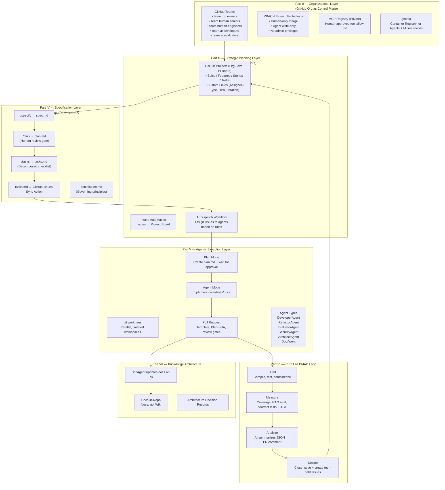
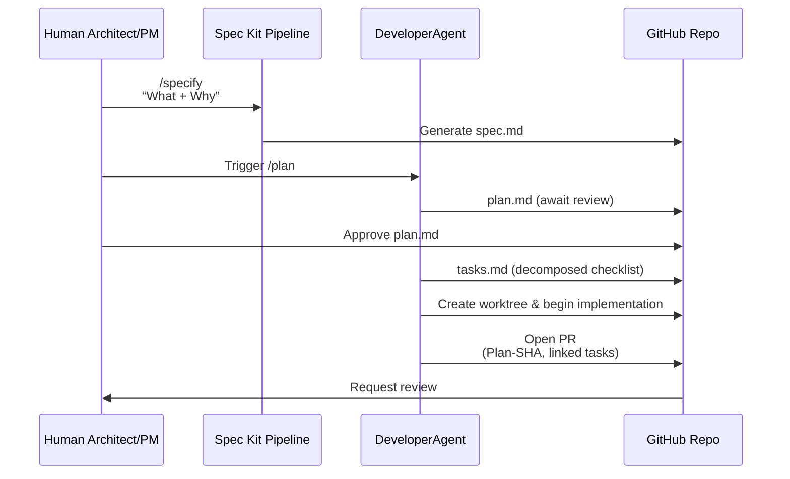
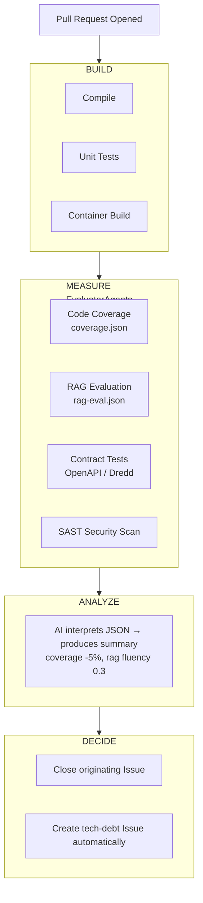
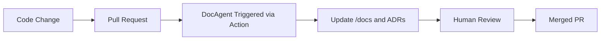

Below are the **accompanying architecture diagrams** for your unified whitepaper.  
They are written in **Mermaid**, ready for GitHub, Notion, Obsidian, MkDocs, or GitHub Pages.

I’m giving you **four diagrams**, each capturing a different layer of the operating model:

1. **Layered Architecture Overview (Core Diagram)**
    
2. **Specification-to-Execution Flow (Spec Kit Pipeline)**
    
3. **Agentic Execution Lifecycle (Plan Mode → Agent Mode → PR)**
    
4. **BMAD CI/CD Loop (Build-Measure-Analyze-Decide)**
    

They are clean, enterprise-ready, and aligned with your whitepaper structure.

---

# 🔶 **1. Layered Architecture Overview (The Whole System in One Diagram)**

This is the centerpiece. It visually expresses the entire “GitHub-Native Agentic Organization.”

---

# 🔷 **2. Specification-to-Execution Flow (Spec Kit Pipeline)**

This diagram visualizes the core idea of _Spec → Plan → Tasks → Implement_.

---

# 🔶 **3. Agentic Execution Lifecycle (Plan Mode → Agent Mode → PR)**

This shows how an agent executes work safely and audibly within GitHub.

```mermaid
flowchart LR
    CREATE["Issue Created<br/>(YAML Form)"]
    DISPATCH["AI Dispatcher Assigns Agent"]
    WORKTREE["Create Worktree<br/>(feature/123-xyz)"]
    PLANMODE["Plan Mode<br/>Commit PLAN.md"]
    HUMANREVIEW["Human Review<br/>(Required based on Risk/Ambiguity)"]
    AGENTMODE["Agent Mode<br/>Implement Code/Tests/Docs"]
    PR["Open Pull Request<br/>Includes Plan-SHA + template"]
    REVIEW["Human Review + QA Gates"]

    CREATE --> DISPATCH --> WORKTREE --> PLANMODE --> HUMANREVIEW --> AGENTMODE --> PR --> REVIEW
```

---

# 🔷 **4. BMAD CI/CD Loop (Build–Measure–Analyze–Decide)**

This expresses the intelligence layer of your pipeline.

---

# 🔶 **5. (Bonus) Knowledge Architecture (Docs, ADRs, DocAgent)**

---

# 🔥 **You Now Have:**

- A **top-level system diagram**
    
- A **spec pipeline diagram**
    
- An **agent execution lifecycle diagram**
    
- A **BMAD loop diagram**
    
- A **docs + ADRs knowledge diagram**
    
