# **The GitHub-Native Agentic Operating Model**

## **Part I — Executive Overview**

The transition to AI-driven software engineering demands a paradigm shift. The prevailing ad-hoc methods—unstructured "vibe coding"¹ and un-governed agentic workflows—are creating a new, significant generation of technical debt. This debt manifests as brittle, non-auditable, and misaligned code, where implementation diverges from business intent before the first pull request is opened. The industry requires a repeatable, robust, and spec-driven system that aligns both human and AI agents on *what* to build and *why* before a single line of code is written.²

This model transforms GitHub into the unified coordination and governance plane for a blended human–AI engineering workforce. It embeds specification discipline, agent governance, CI/CD intelligence, and documentation rigor directly into the development lifecycle. The result is an auditable, scalable operating model that aligns all contributors — human and autonomous — around the same artifacts, the same rules, and the same source of truth.

The primary challenge of leveraging agentic AI is not capability, but governance, safety, and auditability.⁵ This framework's core principle is that *governance must be embedded into the SDLC itself*, not implemented as a separate, external platform. The native constructs of GitHub—RBAC, Pull Request review gates, and protected branches—become the auditable change management plane for all contributors, both human and AI.

This model provides the auditable, scalable, and secure "human infrastructure"⁶ required to manage a high-velocity, AI-augmented engineering organization.

## **Part II — Guiding Principles of a GitHub-Native Agentic Organization**

This operating model is founded on eight core principles that serve as the constitutional basis for all subsequent technical and procedural decisions. These principles must be explicit to ensure all contributors, human and AI, operate from a shared understanding of the system's rules and objectives.

1. **Every contribution is a Pull Request.**  
   No privilege escalation, no bypass routes.  
2. **Governance must be inside the SDLC.**  
   GitHub RBAC, branch protections, and PR review form the safety perimeter.  
3. **Specification is the contract.**  
   All work must begin with an approved spec and plan.  
4. **Ambiguity requires human judgment.**  
   AI agents act autonomously only under low ambiguity and low risk.  
5. **Agents must be modular, audited, and version-controlled.**  
   Their primitives, instructions, and MCP capabilities must be in source control.  
6. **CI/CD is a decision engine.**
   Build → Measure → Analyze → Decide is the backbone of engineering intelligence.  
7. **Documentation must live in the repository.**  
   PR-driven doc updates prevent drift and improve discoverability.  
8. **Knowledge must be explicit.**  
   ADRs preserve the *why* behind the *what*.

## **Part III — The Layered Architecture Overview (Core Diagram)**

Before detailing each technical layer, it is essential to visualize the complete, integrated system. The following diagram illustrates the entire "factory floor" as a unified architecture. It shows how the foundational *Organizational Model* (Part IV) underpins a sequential flow: from high-level *Strategic Planning* (Part V) to *Specification* (Part VI), *Execution* (Part VIl), and *Continuous Improvement* via the *BMAD Loop* (Part VIII). The entire process is supported by a living *Knowledge Architecture* (Part IX).

The subsequent sections of this whitepaper will unpack each of these layers in detail.

```mermaid
%%{init: {"theme":"base", "themeVariables": {"lineColor":"#94a3b8","primaryBorderColor":"#94a3b8","textColor":"#64748b"}}}%%
flowchart TB
    %% Simplified Overview - Progressive Disclosure Pattern

    ORG["🏛️ <b>Part IV — Organizational</b><br/>GitHub org structure, RBAC, MCP registry"]
    PLAN["📋 <b>Part V — Strategic Planning</b><br/>GitHub Projects as Program Board"]
    SPEC["📝 <b>Part VI — Specification</b><br/>Spec Kit: constitution → spec → plan → tasks"]
    EXEC["⚙️ <b>Part VII — Execution</b><br/>Agents, git worktrees, Pull Requests"]
    BMAD["🔄 <b>Part VIII — BMAD Loop</b><br/>CI/CD as intelligence engine"]
    KNOW["📚 <b>Part IX — Knowledge</b><br/>Documentation & ADRs in repo"]

    ORG ==> PLAN
    PLAN ==> SPEC
    SPEC ==> EXEC
    EXEC ==> BMAD
    BMAD -.Feedback.-> PLAN
    EXEC -.Updates.-> KNOW

    classDef foundation fill:#66bb6a,stroke:#388e3c,stroke-width:4px,color:#000000
    classDef planning fill:#42a5f5,stroke:#1976d2,stroke-width:3px,color:#000000
    classDef specification fill:#ab47bc,stroke:#7b1fa2,stroke-width:3px,color:#ffffff
    classDef execution fill:#ffa726,stroke:#f57c00,stroke-width:3px,color:#000000
    classDef intelligence fill:#ef5350,stroke:#c62828,stroke-width:3px,color:#ffffff
    classDef knowledge fill:#26a69a,stroke:#00796b,stroke-width:3px,color:#000000

    class ORG foundation
    class PLAN planning
    class SPEC specification
    class EXEC execution
    class BMAD intelligence
    class KNOW knowledge
```

**Diagram Legend:**
- **Solid arrows (⇒)**: Primary sequential flow
- **Dashed arrows (⇢)**: Feedback loops and continuous updates
- **Color coding**: Each layer uses a distinct color for visual hierarchy
- **Emoji icons**: Enable quick visual scanning of layer types

Each layer is explored in detail in its respective section below, with dedicated diagrams showing internal components and workflows.

## **Part IV — Organizational Operating Model**

This layer defines the foundational "chassis" of the organization, establishing the security, permissions, and governance model necessary to segregate human and AI agent responsibilities. This is the direct implementation of Principle \#2: *Governance must be inside the SDLC*.

```mermaid
%%{init: {"theme":"base", "themeVariables": {"lineColor":"#94a3b8","primaryBorderColor":"#94a3b8","textColor":"#64748b"}}}%%
flowchart TB
    subgraph ORG["🏛️ GitHub Organization (Control Plane)"]
        direction TB

        subgraph TEAMS["GitHub Teams Structure"]
            OWNERS["👥 team.org.owners<br/><i>Min 2 humans, Owner role</i>"]
            SENIORS["👤 team.human.seniors<br/><i>Tech leads, Maintain role</i>"]
            ENGINEERS["👤 team.human.engineers<br/><i>Developers, Write role</i>"]
            AIDEV["🤖 team.ai.developers<br/><i>Machine users, Write role</i>"]
            AIEVAL["🤖 team.ai.evaluators<br/><i>Machine users, Read role</i>"]
        end

        subgraph RBAC["RBAC & Branch Protection"]
            MERGE["✅ Human-only merge<br/>to protected branches"]
            NOADMIN["🚫 No Admin/Owner<br/>for AI agents"]
            WRITE["✏️ AI Write access<br/>(PR creation only)"]
        end

        subgraph INFRA["GitHub Infrastructure"]
            GHCR["📦 ghcr.io<br/>Container Registry<br/><i>Agents & services</i>"]
            MCP["🔧 MCP Registry<br/>Private, human-approved<br/><i>Tool allowlist</i>"]
            REPOS["📁 Repositories<br/><i>Value streams</i>"]
        end
    end

    OWNERS -.Governs.-> SENIORS
    OWNERS -.Approves.-> MCP
    SENIORS --> MERGE
    AIDEV --> WRITE
    AIEVAL -.Reads.-> REPOS
    AIDEV --> GHCR

    classDef foundation fill:#66bb6a,stroke:#388e3c,stroke-width:2px,color:#000000
    classDef teamHuman fill:#42a5f5,stroke:#1976d2,stroke-width:2px,color:#000000
    classDef teamAI fill:#ffa726,stroke:#f57c00,stroke-width:2px,color:#000000
    classDef security fill:#ef5350,stroke:#c62828,stroke-width:2px,color:#ffffff
    classDef infra fill:#ab47bc,stroke:#7b1fa2,stroke-width:2px,color:#ffffff

    class ORG foundation
    class OWNERS,SENIORS,ENGINEERS teamHuman
    class AIDEV,AIEVAL teamAI
    class MERGE,NOADMIN,WRITE security
    class GHCR,MCP,REPOS infra
```

**Key Principles:**
- **Blended teams**: 5 distinct team types with strict role separation
- **Least privilege**: AI agents limited to Write role (no Admin/Owner)
- **Human-in-the-loop**: All merges to protected branches require human approval
- **Tool governance**: MCP Registry acts as capability allowlist

### **1. Org Structure & Blended Teams**

The framework is built on a "single organization with teams" model.⁷ All repositories must be organization-owned to ensure security and administrative control.⁸ Access is managed via GitHub Teams, creating clear, role-based boundaries.⁹ This establishes the "blended workforce" of human and AI contributors.

* **team.org.owners:** Minimal human team (at least two people) with "Owner" role for ultimate oversight.¹⁰  
* **team.human.seniors:** Human technical leads, architects, and principal engineers.  
* **team.human.enginers:** All human software developers.  
* **team.ai.developers:** Machine user accounts for AI agents that *write code*.⁴  
* **team.ai.evaluators:** Machine user accounts for AI agents that *analyze and report on code* (e.g., test runners, RAG evaluators).⁴

### **2. Role-Based Access Control (RBAC) Matrix**

The primary safety mechanism is the strict application of the principle of least privilege. AI agents must never be granted "Owner" or "Admin" roles. The "Admin" role includes catastrophic permissions, such as deleting repositories or bypassing all branch protection.¹⁰ Granting this to an autonomous agent represents an unacceptable organizational risk.

The following table details the precise permissions that form the core of the embedded governance model. The critical distinction is that team.ai.developers have "Write" access (can create branches and open PRs) but *cannot merge* to protected branches, ensuring a human is always in the loop for final approval.

| Team | Organization Role | Repository Role | Key Permissions & Rationale |
| :---- | :---- | :---- | :---- |
| **team.org.owners** | Owner | Admin | Human-only. Full administrative access. Manages billing, security, and team structures.¹⁰ |
| **team.human.seniors** | Member | Maintain | Human-only. Can push to protected branches, manage repository settings, and merge PRs.¹¹ |
| **team.human.engineers** | Member | Write | Standard developer role. Can push to non-protected branches and open PRs.¹¹ |
| **team.ai.developers** | Member | Write | AI agent. Can clone, push to new branches, and open/comment on PRs. \*Cannot merge to protected branches.\*⁴ |
| **team.ai.evaluators** | Member | Read | AI agent. Can clone/read code for analysis. Cannot push code. Outputs are via PR comments or API calls.⁴ |

### **3. GitHub as the Factory Floor**

GitHub is treated as the complete "factory floor," not just a code host.

* **Value Stream Alignment:** Each repository (e.g., product-api, frontend-app) is treated as a distinct "value stream" to isolate concerns and allow for independent governance.¹²  
* **Artifact Registry (ghcr.io):** GitHub Packages serves as the unified "supply chain" for all buildable artifacts.¹³ All AI agents, MCP servers, and application microservices are packaged as Docker images and published to the GitHub Container Registry (ghcr.io).¹⁴  
* **Internal MCP Registry:** The organization will host its *own* internal, private MCP (Model Context Protocol) registry.¹⁵ This registry is the *runtime governance plane for AI agent capabilities*. To make a new tool available (e.g., a "deploy-to-staging" tool), a human must approve a PR to the registry.¹⁶ This "allow list" is the explicit governance step, preventing agents from using un-vetted tools.¹⁷ This implements Principle \#5: *Agents must be... audited, and version-controlled*.

## **Part V — Strategic Planning Layer**

This layer defines the "what" and "when" of development, configuring GitHub Projects to function as a cross-repository Program Increment (PI) board, inspired by the Scaled Agile Framework (SAFE).¹⁸

**Key Components:**
- **Work Item Hierarchy**: Emulates SAFE structure (Epic → Feature → Story → Task)
- **Custom Fields**: `Work-Item-Type`, `Epic-Link`, `Assignee-Type`, `Risk`, `Iteration`
- **Automated Dispatch**: GitHub Actions route AI work to agent queue
- **Single Pane of Glass**: Org-level project aggregates all repositories

### **1. GitHub Projects as the Program Board**

A single, organization-level GitHub Project is created to serve as the unified program board, pulling in Issues from all constituent repositories.¹⁹ This provides the single-pane-of-glass view essential for PI planning.

### **2. Emulating the Work Item Hierarchy**

A widely noted limitation of GitHub Projects is the lack of a native, multi-level work item hierarchy.²⁰ We emulate a SAFE-like structure using a hybrid model that provides a pragmatic, battle-tested workaround:

* **Custom Fields:** A custom Work-Item-Type field is created (Epic, Feature, Story, Task).¹⁹  
* **Strategic Linking:** A custom Epic-Link field is created. Feature and Story issues are linked to a parent Epic by setting this field.²¹  
* **Tactical Nesting:** Task issues are linked to their parent Story using the *native* "Parent issue" field.²²

This hybrid model allows for strategic grouping in the "Roadmap" layout while still using native parent/child relationships for tactical progress roll-up.

### **3. AI Work Queue & Automated Dispatch**

Work item intake and dispatch are automated by combining native Project automations with GitHub Actions. This is the "on-ramp" that feeds the entire agentic factory floor.

1. **Intake:** A human (or AI) creates a new Issue.  
2. **Triage:** A GitHub Action (on: issues: opened) automatically adds it to the organization-level Project Board.²³ The workflow (or a human) parses the Issue. If it's tagged for AI, the workflow sets the custom field Assignee-Type to AI.²⁴  
3. **Handoff:** A native Project automation rule triggers: "When Assignee-Type is set to AI, move item to the AI Backlog column."²²  
4. **AI Dispatch:** A separate, scheduled GitHub Action (the "agent-dispatcher") queries the board for items in the AI Backlog. It finds an available agent from team.ai.developers, assigns the issue, and notifies the agent (via webhook or polling) to begin work.

## **Part VI — Specification Layer (Spec Kit \+ Constitution)**

This is the "intake engine" for the factory floor, formalizing human intent into structured, machine-readable specifications that govern all AI execution. This layer is the embodiment of Principle \#3: *Specification is the contract*.

The flow from specification to execution is a collaborative process between humans and agents, governed by auditable artifacts.

### **1. Constitutions, Specs, and Tasking**

We mandate the use of the GitHub Spec Kit as the tactical tool for implementing Spec-Driven Development (SDD).²

* **/speckit.constitution:** The *zeroth step of governance*. A human architect defines the constitution.md file, establishing the project's "governing principles," tech stack, and testing standards *before* any feature work begins.²⁵  
* **/speckit.specify:** The human (PM, Architect) defines the "what" and "why" of the feature in spec.md.²⁵  
* **/speckit.plan:** The AI agent generates the "how" in plan.md. This plan represents the *first critical human review gate*.²⁵  
* **/speckit.tasks:** Once the plan is approved, the AI agent breaks it down into a granular tasks.md checklist.²⁵  
* **/speckit.implement:** The AI agent executes the tasks.md file.²⁵

To make this process machine-parsable, we use **YAML Issue Forms**.²⁶ When a human requests work, they are presented with a structured form, not a blank markdown body. The form's YAML output is embedded in the issue, providing the AI agent with its initial, structured "tasking."

### **2. The Risk & Ambiguity Routing Matrix**

This matrix is the *brain* of the operating model, defining the precise workflow and human-in-the-loop (HITL) checkpoints for any given task.²⁷ It is the architectural antidote to "unnecessary bloat,"²⁸ as it prevents an AI from "over-planning" in a vacuum. This is the explicit implementation of Principle \#4: *Ambiguity requires human judgment*.

The matrix routes work based on two simple axes: risk and ambiguity, ensuring that human oversight is applied precisely where it adds the most value.

| Task Type | Risk / Ambiguity | Routing Workflow | Human Checkpoint |
| :---- | :---- | :---- | :---- |
| **Well-Defined Refactor** | Low Risk, Low Ambiguity | **Autonomous:** Route to AI Executor → AI QA. | Auto-merge on pass.²⁹ |
| **New Greenfield Feature** | Low Risk, High Ambiguity | **Supervised Plan:** AI generates plan.md → **HALT**. | **Mandatory Plan Review** by Human Architect.³⁰ |
| **Security/Auth Change** | High Risk, Low Ambiguity | **Supervised Implement:** AI Executor → AI QA → **HALT**. | **Mandatory PR Review** by Human Senior.²⁹ |
| **Production Bug Fix** | High Risk, High Ambiguity | **Human-Only:** Page human on-call. | **Mandatory Human Intervention**. |

### **3. The "Spec-to-Work-Item" Bridge (Critical Automation)**

A critical, unaddressed gap in the Spec Kit ecosystem is that tasks.md is a simple markdown file, disconnected from GitHub Projects.³¹ This creates a "black hole" for organizational transparency, as project managers cannot see the tactical progress of an agent's plan.

We solve this with a custom GitHub Action workflow (sync-tasks-to-projects.yml):³²

* **Trigger:** Runs on: push to any branch modifying **/tasks.md.³³  
* **Parse:** The Action parses the tasks.md checklist.  
* **De-duplicate & Sync:** The script queries the GitHub Project board.³¹  
  * If a task is *new*, it creates a new GitHub Issue and links it to the parent "Spec" Epic.  
  * If a task is checked off, a separate hook closes the corresponding Issue.

This automation is the essential lynchpin of organizational transparency. It forges an unbreakable, auditable chain of traceability:

**Spec (Git) → Task (tasks.md) → Work Item (Issue) → Code (Commit) → Review (PR)**

## **Part VII — The Agentic Execution Layer**

This layer defines the tactical execution loop for a single work item, detailing the flow from Issue creation to a merged Pull Request.

The agentic lifecycle ensures that all AI-generated work is auditable, isolated, and conforms to the approved plan.

```mermaid
%%{init: {"theme":"base", "themeVariables": {"lineColor":"#94a3b8","primaryBorderColor":"#94a3b8","textColor":"#64748b"}}}%%
flowchart TB
    subgraph AGENTS["🤖 Agent Role Taxonomy"]
        direction LR
        DEV["💻 DeveloperAgent<br/><i>Features & bugfixes</i>"]
        REFACTOR["♻️ RefactorAgent<br/><i>Tech debt cleanup</i>"]
        SECURITY["🔒 SecurityAgent<br/><i>Vulnerability patches</i>"]
        EVAL["📊 EvaluatorAgent<br/><i>CI/CD quality checks</i>"]
        ARCH["🏗️ ArchitectAgent<br/><i>ADR compliance review</i>"]
        DOC["📖 DocAgent<br/><i>Documentation updates</i>"]
    end

    subgraph WORKSPACE["🌳 Git Worktrees (Parallel Isolation)"]
        direction TB
        MAIN["📁 main/<br/><i>Main worktree</i>"]
        WT1["📁 ../feature-123/<br/><i>Agent 1 workspace</i>"]
        WT2["📁 ../feature-456/<br/><i>Agent 2 workspace</i>"]
        WT3["📁 ../refactor-789/<br/><i>Agent 3 workspace</i>"]

        MAIN-. Shares git dir .->WT1
        MAIN-. Shares git dir .->WT2
        MAIN-. Shares git dir .->WT3
    end

    subgraph PRFLOW["📥 Pull Request Flow"]
        direction TB
        PLAN["📝 1. Commit PLAN.md<br/><i>Plan SHA for audit</i>"]
        IMPL["⚙️ 2. Implement code/tests<br/><i>Follows plan</i>"]
        PR["🔀 3. Open PR<br/><i>Template with Plan-SHA</i>"]
        REVIEW["👤 4. Human Review<br/><i>Required for merge</i>"]

        PLAN --> IMPL --> PR --> REVIEW
    end

    DEV --> WT1
    REFACTOR --> WT2
    WT1 --> PLAN
    WT2 --> PLAN

    classDef execution fill:#ffa726,stroke:#f57c00,stroke-width:2px,color:#000000
    classDef agent fill:#ffa726,stroke:#f57c00,stroke-width:2px,color:#000000
    classDef worktree fill:#66bb6a,stroke:#388e3c,stroke-width:2px,color:#000000
    classDef flow fill:#ab47bc,stroke:#7b1fa2,stroke-width:2px,color:#ffffff

    class AGENTS execution
    class DEV,REFACTOR,SECURITY,EVAL,ARCH,DOC agent
    class MAIN,WT1,WT2,WT3 worktree
    class PLAN,IMPL,PR,REVIEW flow
```

**Key Concepts:**
- **6 Specialized Agent Types**: Modular roles with clear responsibilities
- **Git Worktrees**: Parallel, isolated workspaces prevent context confusion
- **Plan-First Workflow**: PLAN.md committed before implementation for auditability
- **Human-in-the-Loop**: All PRs require human review before merge

### Execution Sequence Diagram

### **1. Agent Role Taxonomy**

Agents are specialized by function to promote modularity and assign responsibility.³⁴ This is the single source of truth for agent roles.

* **DeveloperAgent:** The primary "coder" for features and bugfixes.  
* **RefactorAgent:** Specialized in addressing technical debt and optimizing code.³⁴  
* **SecurityAgent:** Monitors for vulnerabilities and generates patches.³⁵  
* **EvaluatorAgent:** Lives in the CI/CD pipeline; runs on pull_request to measure quality, test coverage, RAG fluency, etc.³⁶  
* **ArchitectAgent:** A specialized agent that reviews PRs for "architecture drift," ensuring new code adheres to established ADRs.  
* **DocAgent:** Responsible for documentation; can be triggered by PRs to update /docs based on code changes.³⁷

### **2. Agent Workspaces & Branching Model**

A scaled agentic team cannot function from a single repository clone. To prevent "context confusion" where agents overwrite each other's changes,³⁸ this model **mandates** the use of git worktrees. This is the single source of truth for this critical, scalable practice.

A worktree creates a separate, isolated working directory for a new branch, allowing for parallel, multi-agent development without conflict.³⁹

The agent's workstream is explicit and auditable:

1. **Branch:** The agent creates a new branch (feature/123-new-auth) and a new worktree.  
2. **Plan Commit:** The agent's *first* action is to commit the PLAN.md file. This serves as the "auditable blueprint" and the "Plan SHA."⁴⁰  
3. **Implement:** The agent executes the plan, committing code, tests, and docs.⁴¹  
4. **PR:** The agent opens a Pull Request, populating a template that *must* include:⁴²  
   * Fixes \#123  
   * Plan-SHA: <sha-of-PLAN.md-commit>  
   * Human-Oversight-Required: true

### **3. Agentic Primitives**

An agent's core behavior (its "instructions") must be managed as source code, directly implementing Principle \#5. We maintain a central ai-primitives repository containing markdown files (e.g., primitives/developer/feature.prompt.md). When an agent spins up, it clones this repo to load its instructions, ensuring all agent behavior is version-controlled and auditable.⁴³

## **Part VIII — CI/CD as a BMAD Loop**

This synthesizes the entire system into the dynamic, iterative **BMAD (Build-Measure-Analyze-Decide)** cycle.⁴⁴ The CI/CD pipeline is transformed from a simple test runner into a comprehensive intelligence and governance loop, embodying Principle \#6: *CI/CD is a decision engine*.⁴⁵

The BMAD loop is a closed feedback system, where the outputs of the "Decide" phase automatically generate new work, ensuring continuous improvement.

The loop consists of four distinct stages executed within GitHub Actions:

**BUILD:**

* **Trigger:** on: pull_request  
* **Action:** Standard CI job. Compile code, run unit tests, build container.⁴⁶

**MEASURE:**

* **Trigger:** needs: build  
* **Action:** A parallel matrix of EvaluatorAgents runs to produce machine-readable reports.³⁶  
  * run-code-coverage: Outputs coverage.json.⁴⁷  
  * run-rag-eval: (If applicable) Uses RAGAS⁴⁸ or DeepEval⁴⁹ against a golden dataset to check for *RAG Hallucination* and quality. Outputs rag-eval.json.  
  * run-contract-test: (If applicable) Uses Dredd⁵⁰ or Speakeasy⁵¹ to test the API against its OpenAPI spec to prevent *Spec Drift*.  
  * run-security-scan: Runs SAST scanners.

**ANALYZE:**

* **Trigger:** needs: measure  
* **Action:** An AI agent interprets the raw JSON reports.  
* **Prompt:** "Summarize these findings: coverage.json shows a 5% drop. rag-eval.json shows fluency at 0.3. Provide a 'go/no-go' recommendation."⁵²  
* **Output:** The agent posts this human-readable summary as a PR comment, tagging team.human.seniors.

**DECIDE:**

* **Trigger:** on: pull_request: types: [closed]  
* **Action:** This is the "learning" part of the loop.  
  * **If Merged:** The workflow finds the original Issue (\#123) and updates its Status on the Project Board to Done.²⁴  
  * **Loop Closure:** The workflow also checks the Analyze job's output. If it produced a tech-debt.json artifact (e.g., test coverage was low), the workflow *automatically creates a new issue* titled "TECH DEBT: Refactor auth.py for low test coverage."⁵³  
* **Result:** This new issue is automatically added to the Project Board, ready for the next sprint. The BMAD loop is closed, ensuring continuous improvement.

## **Part IX — Knowledge Architecture**

This layer defines how the organization documents its products, processes, and architectural decisions, ensuring knowledge is co-located with the code and accessible to both humans and AI.

This architecture is not a passive repository; it is an active, agent-driven system that enforces Principle \#7 (*Documentation must live in the repository*) and Principle \#8 (*Knowledge must be explicit*). [2, 2]

### **1. The "No Wiki" Mandate**

The GitHub Wiki feature **must be disabled**. This is an architectural mandate, not a preference.

The Wiki is an "anti-pattern" in an agentic model because it does not support Pull Requests.⁵⁴ This violates Principle \#1: *Every contribution is a Pull Request*. AI agents' primary, auditable output mechanism is the PR. If knowledge lives in a system that agents cannot programmatically and auditably update, that knowledge will inevitably become stale.

Therefore, all documentation—for the product, its architecture, and team processes—will be stored in a /docs folder within the main repository.⁵⁵

### **2. PR-Triggered Doc Agent**

This model ensures documentation is versioned alongside code and can be updated by AI agents via the same auditable PR flow.

A GitHub Action triggers a DocAgent on PRs. The agent analyzes the code diff, identifies which /docs files are now out-of-date, and *commits the necessary documentation changes back to the same PR branch*.³⁷ This ensures code and its corresponding documentation are reviewed and merged together, preventing drift.

### **3. Architecture Decision Records (ADRs)**

To capture the *why* behind architectural choices, we use ADRs—lightweight markdown documents stored in /docs/adr/.⁵⁶ This practice treats critical decisions as version-controlled artifacts that can be proposed, debated, and accepted via Pull Request.⁵⁷ An ArchitectAgent can even be tasked with auditing new PRs for compliance with existing ADRs.

## **Part X — End-to-End Playbooks**

These narrative examples demonstrate how all layers work in concert to create a cohesive, governed, and high-velocity system.

* **Human Onboarding:** New hire is added to team.human.engineers. They automatically inherit "Write" access¹¹ and read the /docs/process/ folder to understand team standards.  
* **AI Agent Onboarding:** A human Sr. Dev opens a PR to the mcp-registry repo to add mcp/doc-agent-002.server.json.¹⁷ A team.human.seniors member reviews and approves this "allow list" change.¹⁶ The agent's Docker image is published to ghcr.io.¹⁴ An owner adds the new doc-agent-002-bot machine user to team.ai.developers.⁴  
* **Agentic Feature Lifecycle:**  
  1. Human creates Issue \#123 via YAML form.²⁶  
  2. Triage Action adds it to the Project Board²³ and sets Assignee-Type: AI.²⁴  
  3. Dispatcher Action assigns \#123 to dev-agent-001.  
  4. Agent creates a worktree,³⁹ commits PLAN.md,⁴⁰ implements code, and opens a PR.⁴²  
  5. BMAD workflow runs. The Analyze bot posts: "✅ All tests pass. Coverage \+3%."⁵²  
  6. team.human.seniors member reviews the PLAN.md, the code, and the AI's analysis, then merges.  
  7. Decide workflow closes Issue \#123.²⁴  
* **Human \+ AI Collaboration:** A human dev gets stuck and comments on their PR: @copilot-refactor-bot please simplify this function and add coverage. The bot checks out the branch, pushes a new commit with the refactor, and comments "Done."  
* **AI-Driven Refactor Sprint:** An Architect creates 20 "Refactor" issues and bulk-sets Assignee-Type: AI. The agent-dispatcher spins up 5 available agents, which use git worktrees in parallel.³⁹ Within hours, 20 PRs are opened, each with its own plan and analysis, ready for human review.  
* **The BMAD Feedback Loop:** A human merges a PR. The Measure job notes 30% test coverage.⁴⁷ The Analyze bot posts a warning.⁵² The Decide workflow closes the original feature issue *and* creates a new "TECH DEBT: Increase coverage for feature-xyz.py" issue, adding it to the current sprint backlog.⁵³ The loop is complete.

## **Part XI — Governance Appendix**

This operating model embeds governance directly into the GitHub-native workflow. Governance is not a separate-stage gate; it is a continuous, automated, and auditable process.

The key pillars of this embedded governance are:

1. **Role-Based Access Control (RBAC):** A strict, team-based matrix (as detailed in Part IV) that segregates human and AI permissions, enforcing the principle of least privilege. 1  
2. **MCP "Allow List" Registry:** A human-in-the-loop review gate for approving all new AI agent capabilities (tools, APIs). If it's not in the internal registry, no agent can run it.¹⁷  
3. **Risk & Ambiguity Routing:** A "human-in-the-loop" (HITL) framework (detailed in Part VI) that ensures high-risk or high-ambiguity tasks receive mandatory human oversight at the "plan" or "PR" stage.²⁷  
4. **Spec-as-Contract:** The use of CI/CD (e.g., Contract Testing, RAG Evals) to automatically enforce that all code *conforms* to its original specification, preventing "Spec Drift"⁵⁸ and "RAG Hallucination."⁴⁸  
5. **The "MentorScript" Flywheel:** The formal process of codifying human PR feedback *back into* the constitution.md file, ensuring that human insight is captured and used to continuously train the entire agentic system.⁵⁹

By treating GitHub as a complete "factory floor" and AI agents as first-class contributors, this framework provides the structure needed to manage, scale, and govern the next generation of software engineering.

## **Part XII — Conclusion**

This operating model is not theoretical. It reflects the real conditions under which AI-augmented engineering must operate: high velocity, high ambiguity, and high accountability. By grounding governance, specification, execution, and learning inside GitHub itself, organizations gain a system that scales safely and improves continuously.

This is how modern engineering organizations — human and AI — build software together.

## **Part XIII — Reference Notes**

1. Spec-driven development with AI: Get started with a new open source toolkit, accessed November 13, 2025, [https://github.blog/ai-and-ml/generative-ai/spec-driven-development-with-ai-get-started-with-a-new-open-source-toolkit/](https://github.blog/ai-and-ml/generative-ai/spec-driven-development-with-ai-get-started-with-a-new-open-source-toolkit/)  
2. GitHub Spec Kit: A Guide to Spec-Driven AI Development \- IntuitionLabs, accessed November 13, 2025, [https://intuitionlabs.ai/pdfs/github-spec-kit-a-guide-to-spec-driven-ai-development.pdf](https://intuitionlabs.ai/pdfs/github-spec-kit-a-guide-to-spec-driven-ai-development.pdf)  
3. Bhavik-Jikadara/Content-Generation-Workflow: Implementing a scalable content team using AI... \- GitHub, accessed November 13, 2025,(https://github.com/Bhavik-Jikadara/Content-Generation-Workflow)  
4. Types of GitHub accounts, accessed November 13, 2025, [https://docs.github.com/en/get-started/learning-about-github/types-of-github-accounts](https://docs.github.com/en/get-started/learning-about-github/types-of-github-accounts)  
5. What is Agentic AI? \- GitHub, accessed November 13, 2025, [https://github.com/resources/articles/what-is-agentic-ai](https://github.com/resources/articles/what-is-agentic-ai)  
6. GitHub's internal playbook for building an AI-powered workforce, accessed November 13, 2025, [https://resources.github.com/enterprise/ai-powered-workforce-playbook/](https://resources.github.com/enterprise/ai-powered-workforce-playbook/)  
7. Best practices for structuring organizations in your enterprise \- GitHub Docs, accessed November 13, 2025, [https://docs.github.com/en/enterprise-cloud@latest/admin/managing-accounts-and-repositories/managing-organizations-in-your-enterprise/best-practices-for-structuring-organizations-in-your-enterprise](https://docs.github.com/en/enterprise-cloud@latest/admin/managing-accounts-and-repositories/managing-organizations-in-your-enterprise/best-practices-for-structuring-organizations-in-your-enterprise)  
8. Best practices for organizing work in your enterprise \- GitHub Docs, accessed November 13, 2025, [https://docs.github.com/enterprise-cloud@latest/admin/overview/best-practices-for-enterprises](https://docs.github.com/enterprise-cloud@latest/admin/overview/best-practices-for-enterprises)  
9. Best practices for managing GitHub organizations \- Graphite.com, accessed November 13, 2025, [https://graphite.com/guides/managing-github-organizations](https://graphite.com/guides/managing-github-organizations)  
10. Best practices for organizations \- GitHub Docs, accessed November 13, 2025, [https://docs.github.com/en/organizations/collaborating-with-groups-in-organizations/best-practices-for-organizations](https://docs.github.com/en/organizations/collaborating-with-groups-in-organizations/best-practices-for-organizations)  
11. Roles in an organization \- GitHub Docs, accessed November 13, 2025, [https://docs.github.com/en/organizations/managing-peoples-access-to-your-organization-with-roles/roles-in-an-organization](https://docs.github.com/en/organizations/managing-peoples-access-to-your-organization-with-roles/roles-in-an-organization)  
12. How To Structure Your Git Repository For DevOps Automation | Octopus blog, accessed November 13, 2025, [https://octopus.com/blog/devops-automation-repo-design](https://octopus.com/blog/devops-automation-repo-design)  
13. Introduction to GitHub Packages, accessed November 13, 2025, [https://docs.github.com/en/packages/learn-github-packages/introduction-to-github-packages](https://docs.github.com/en/packages/learn-github-packages/introduction-to-github-packages)  
14. Working with the Container registry \- GitHub Docs, accessed November 13, 2025, [https://docs.github.com/packages/working-with-a-github-packages-registry/working-with-the-container-registry](https://docs.github.com/packages/working-with-a-github-packages-registry/working-with-the-container-registry)  
15. Meet the GitHub MCP Registry: The fastest way to discover MCP..., accessed November 13, 2025, [https://github.blog/ai-and-ml/github-copilot/meet-the-github-mcp-registry-the-fastest-way-to-discover-mcp-servers/](https://github.blog/ai-and-ml/github-copilot/meet-the-github-mcp-registry-the-fastest-way-to-discover-mcp-servers/)  
16. How to find, install, and manage MCP servers with the GitHub MCP Registry, accessed November 13, 2025, [https://github.blog/ai-and-ml/generative-ai/how-to-find-install-and-manage-mcp-servers-with-the-github-mcp-registry/](https://github.blog/ai-and-ml/generative-ai/how-to-find-install-and-manage-mcp-servers-with-the-github-mcp-registry/)  
17. A community driven registry service for Model Context Protocol (MCP) servers. \- GitHub, accessed November 13, 2025, [https://github.com/modelcontextprotocol/registry](https://github.com/modelcontextprotocol/registry)  
18. Best practices for SAFe® program increment planning \- Aha\! knowledge base, accessed November 13, 2025, [https://support.aha.io/aha-develop/getting-started/best-practices/best-practices-safe-program-increment-planning](https://support.aha.io/aha-develop/getting-started/best-practices/best-practices-safe-program-increment-planning)  
19. Planning and tracking with Projects \- GitHub Docs, accessed November 13, 2025, [https://docs.github.com/en/issues/planning-and-tracking-with-projects/learning-about-projects/about-projects](https://docs.github.com/en/issues/planning-and-tracking-with-projects/learning-about-projects/about-projects)  
20. Epics · community · Discussion \#52390 \- GitHub, accessed November 13, 2025, [https://github.com/orgs/community/discussions/52390](https://github.com/orgs/community/discussions/52390)  
21. [projects beta] Handling features within a project (epics/umbrellas) · community · Discussion \#7267 \- GitHub, accessed November 13, 2025, [https://github.com/orgs/community/discussions/7267](https://github.com/orgs/community/discussions/7267)  
22. About Projects \- GitHub Docs, accessed November 13, 2025, [https://docs.github.com/en/issues/planning-and-tracking-with-projects/learning-about-projects/about-projects](https://docs.github.com/en/issues/planning-and-tracking-with-projects/learning-about-projects/about-projects)  
23. actions/add-to-project: Automate adding issues and pull requests to GitHub projects, accessed November 13, 2025, [https://github.com/actions/add-to-project](https://github.com/actions/add-to-project)  
24. Update Project v2 Item Field \- GitHub Marketplace, accessed November 13, 2025, [https://github.com/marketplace/actions/update-project-v2-item-field](https://github.com/marketplace/actions/update-project-v2-item-field)  
25. github/spec-kit: Toolkit to help you get started with Spec-Driven Development, accessed November 13, 2025, [https://github.com/github/spec-kit](https://github.com/github/spec-kit)  
26. About issue and pull request templates \- GitHub Docs, accessed November 13, 2025, [https://docs.github.com/en/communities/using-templates-to-encourage-useful-issues-and-pull-requests/about-issue-and-pull-request-templates](https://docs.github.com/en/communities/using-templates-to-encourage-useful-issues-and-pull-requests/about-issue-and-pull-request-templates)  
27. Operating Model for Hybrid (AI \+ Human) Organisations. \- Versatile..., accessed November 13, 2025, [https://versatile.consulting/operating-model-hybrid-ai-human-organisations/](https://versatile.consulting/operating-model-hybrid-ai-human-organisations/)  
28. Spec Kit: Github's NEW tool That Fixes Vibe Coding?, accessed November 13, 2025, [https://www.youtube.com/watch?v=j2-HPeMVUFA](https://www.youtube.com/watch?v=j2-HPeMVUFA)  
29. Defining human-AI teaming the human-centered way: a scoping review and network analysis \- PMC \- PubMed Central, accessed November 13, 2025, [https://pmc.ncbi.nlm.nih.gov/articles/PMC10570436/](https://pmc.ncbi.nlm.nih.gov/articles/PMC10570436/)  
30. Introducing Agent HQ: Any agent, any way you work \- The GitHub Blog, accessed November 13, 2025, [https://github.blog/news-insights/company-news/welcome-home-agents/](https://github.blog/news-insights/company-news/welcome-home-agents/)  
31. Spec-kit and Github Issues/Projects \#880, accessed November 13, 2025, [https://github.com/github/spec-kit/issues/880](https://github.com/github/spec-kit/issues/880)  
32. GitHub Actions documentation, accessed November 13, 2025, [https://docs.github.com/actions](https://docs.github.com/actions)  
33. Workflow syntax for GitHub Actions, accessed November 13, 2025, [https://docs.github.com/actions/using-workflows/workflow-syntax-for-github-actions](https://docs.github.com/actions/using-workflows/workflow-syntax-for-github-actions)  
34. sdi2200262/agentic-project-management: A framework for managing complex projects with AI assistants... \- GitHub, accessed November 13, 2025, [https://github.com/sdi2200262/agentic-project-management](https://github.com/sdi2200262/agentic-project-management)  
35. aliasrobotics/cai: Cybersecurity AI (CAI), the framework for AI Security \- GitHub, accessed November 13, 2025, [https://github.com/aliasrobotics/cai](https://github.com/aliasrobotics/cai)  
36. How to run an evaluation in GitHub Action \- Azure AI Foundry | Microsoft Learn, accessed November 13, 2025, [https://learn.microsoft.com/en-us/azure/ai-foundry/how-to/evaluation-github-action](https://learn.microsoft.com/en-us/azure/ai-foundry/how-to/evaluation-github-action)  
37. Automate Your Documentation with Claude Code & GitHub Actions..., accessed November 13, 2025, [https://medium.com/@fra.bernhardt/automate-your-documentation-with-claude-code-github-actions-a-step-by-step-guide-2be2d315ed45](https://medium.com/@fra.bernhardt/automate-your-documentation-with-claude-code-github-actions-a-step-by-step-guide-2be2d315ed45)  
38. Parallel AI Development with Git Worktrees: A Strategic Implementation Guide, accessed November 13, 2025, [https://sgryt.com/posts/git-worktree-parallel-ai-development/](https://sgryt.com/posts/git-worktree-parallel-ai-development/)  
39. Using Git Worktrees for Multi-Feature Development with AI Agents \- Nick Mitchinson, accessed November 13, 2025, [https://www.nrmitchi.com/2025/10/using-git-worktrees-for-multi-feature-development-with-ai-agents/](https://www.nrmitchi.com/2025/10/using-git-worktrees-for-multi-feature-development-with-ai-agents/)  
40. Plan Mode vs Agent Mode: Understanding GitHub's Revolutionary Coding Workflows, accessed November 13, 2025, [https://skywork.ai/blog/agent/plan-mode-vs-agent-mode-understanding-githubs-revolutionary-coding-workflows/](https://skywork.ai/blog/agent/plan-mode-vs-agent-mode-understanding-githubs-revolutionary-coding-workflows/)  
41. Agent mode 101: All about GitHub Copilot's powerful mode \- The GitHub Blog, accessed November 13, 2025, [https://github.blog/ai-and-ml/github-copilot/agent-mode-101-all-about-github-copilots-powerful-mode/](https://github.blog/ai-and-ml/github-copilot/agent-mode-101-all-about-github-copilots-powerful-mode/)  
42. Copilot coding agent now supports pull request templates \- GitHub..., accessed November 13, 2025, [https://github.blog/changelog/2025-11-05-copilot-coding-agent-now-supports-pull-request-templates/](https://github.log/changelog/2025-11-05-copilot-coding-agent-now-supports-pull-request-templates/)  
43. How to build reliable AI workflows with agentic primitives and context engineering, accessed November 13, 2025, [https://github.blog/ai-and-ml/github-copilot/how-to-build-reliable-ai-workflows-with-agentic-primitives-and-context-engineering/](https://github.blog/ai-and-ml/github-copilot/how-to-build-reliable-ai-workflows-with-agentic-primitives-and-context-engineering/)  
44. bmad-code-org/BMAD-METHOD: Breakthrough Method for Agile Ai Driven Development \- GitHub, accessed November 13, 2025,([https://github.com/bmad-code-org/BMAD-METHOD](https://github.com/bmad-code-org/BMAD-METHOD))  
45. Understanding GitHub Actions, accessed November 13, 2025, [https://docs.github.com/articles/getting-started-with-github-actions](https://docs.github.com/articles/getting-started-with-github-actions)  
46. Publishing and installing a package with GitHub Actions, accessed November 13, 2025, [https://docs.github.com/en/packages/managing-github-packages-using-github-actions-workflows/publishing-and-installing-a-package-with-github-actions](https://docs.github.com/en/packages/managing-github-packages-using-github-actions-workflows/publishing-and-installing-a-package-with-github-actions)  
47. Code Coverage Summary · Actions · GitHub Marketplace · GitHub, accessed November 13, 2025, [https://github.com/marketplace/actions/code-coverage-summary](https://github.com/marketplace/actions/code-coverage-summary)  
48. RAG Evaluation: Don't let customers tell you first \- Pinecone, accessed November 13, 2025, [https://www.pinecone.io/learn/series/vector-databases-in-production-for-busy-engineers/rag-evaluation/](https://www.pinecone.io/learn/series/vector-databases-in-production-for-busy-engineers/rag-evaluation/)  
49. RAG Evaluation: The Definitive Guide to Unit Testing RAG in CI/CD \- Confident AI, accessed November 13, 2025, [https://www.confident-ai.com/blog/how-to-evaluate-rag-applications-in-ci-cd-pipelines-with-deepeval](https://www.confident-ai.com/blog/how-to-evaluate-rag-applications-in-ci-cd-pipelines-with-deepeval)  
50. Enforcing API Correctness: Automated Contract Testing with OpenAPI and Dredd, accessed November 13, 2025, [https://dev.to/r3d_cr0wn/enforcing-api-correctness-automated-contract-testing-with-openapi-and-dredd-2212](https://dev.to/r3d_cr0wn/enforcing-api-correctness-automated-contract-testing-with-openapi-and-dredd-2212)  
51. OpenAPI Spec Drift Detection \- Speakeasy, accessed November 13, 2025, [https://www.speakeasy.com/blog/openapi-spec-drift-detection](https://www.speakeasy.com/blog/openapi-spec-drift-detection)  
52. qodo-ai/pr-agent: PR-Agent: An AI-Powered Tool for Automated Pull Request Analysis, Feedback, Suggestions and More\! \- GitHub, accessed November 13, 2025, [https://github.com/qodo-ai/pr-agent](https://github.com/qodo-ai/pr-agent)  
53. Automate your project with GitHub Models in Actions \- The GitHub..., accessed November 13, 2025, [https://github.blog/ai-and-ml/generative-ai/automate-your-project-with-github-models-in-actions/](https://github.blog/ai-and-ml/generative-ai/automate-your-project-with-github-models-in-actions/)  
54. The GitHub wiki is an anti-pattern | michaelheap.com, accessed November 13, 2025, [https://michaelheap.com/github-wiki-is-an-antipattern/](https://michaelheap.com/github-wiki-is-an-antipattern/)  
55. What's the difference between docs and Wikis? · community · Discussion \#141193 \- GitHub, accessed November 13, 2025, [https://github.com/orgs/community/discussions/141193](https://github.com/orgs/community/discussions/141193)  
56. Architecture decision record (ADR) examples for software planning, IT leadership, and template documentation \- GitHub, accessed November 13, 2025, [https://github.com/joelparkerhenderson/architecture-decision-record](https://github.com/joelparkerhenderson/architecture-decision-record)  
57. The Importance of Architecture Decision Records (ADRs) | by David Haylock | Medium, accessed November 13, 2025, [https://medium.com/@david_haylock/the-importance-of-architecture-decision-records-adrs-9225f5dd8887](https://medium.com/@david_haylock/the-importance-of-architecture-decision-records-adrs-9225f5dd8887)  
58. Spec Drift: The Hidden Problem AI Can Help Fix \- Kinde, accessed November 13, 2025, [https://kinde.com/learn/ai-for-software-engineering/ai-devops/spec-drift-the-hidden-problem-ai-can-help-fix/](https://kinde.com/learn/ai-for-software-engineering/ai-devops/spec-drift-the-hidden-problem-ai-can-help-fix/)  
59. Agentic Software Engineering: Foundational Pillars and a Research Roadmap \- arXiv, accessed November 13, 2025, [https://arxiv.org/html/2509.06216v1](https://arxiv.org/html/2509.06216v1)

